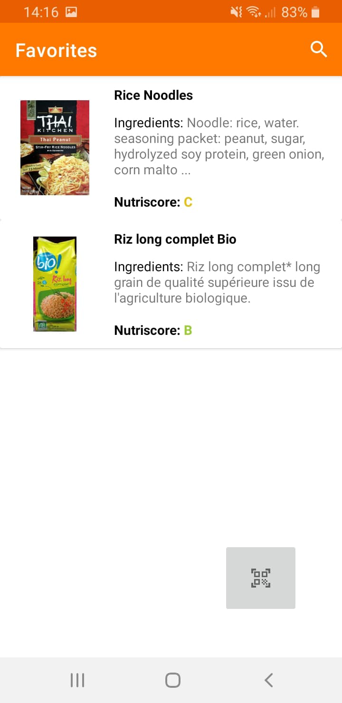
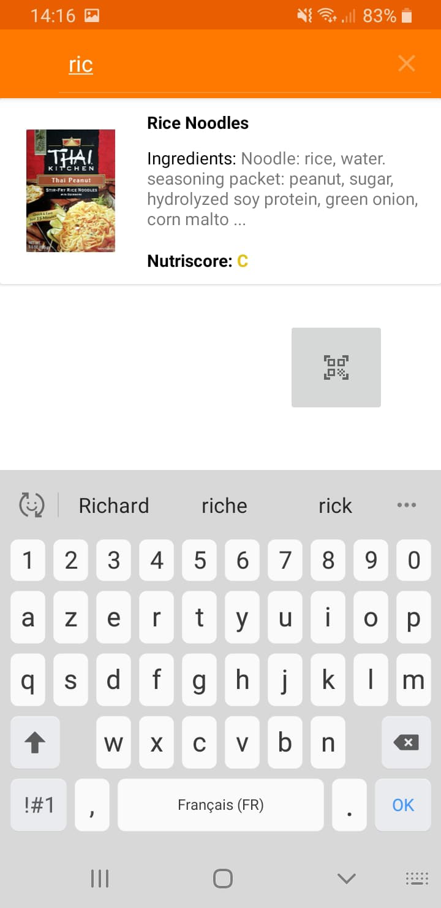
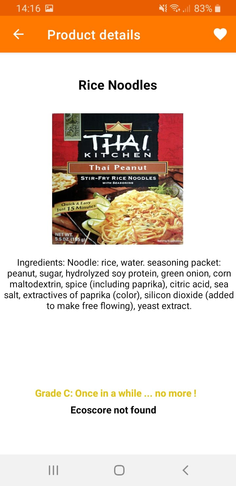
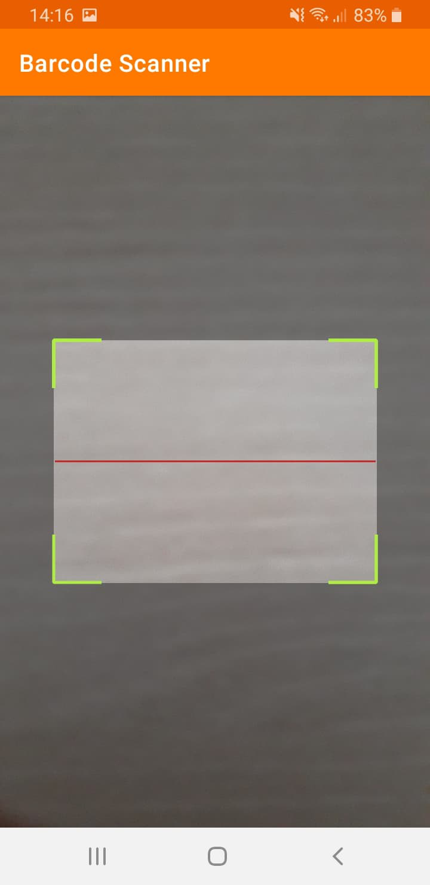

# TP Application Mobile

## Guide utilisateur

### Page d'accueil

Lors de l'arrivé sur l'application la page d'accueil comporte la **liste des produits mis en favoris**. Des informations sur ces produits sont disponibles directement dans cette liste tel que **son nom**, **sa photo**, **ses ingrédients**, **son écoscore** ainsi que son **nutriscore**.

Pour chercher un produit dans cette liste plusieurs options sont disponibles :

#### 1. La recherche par navigation

Simple et parfois plutôt efficace, vous pouvez naviguer de haut en bas afin de trouver le produit que vous cherchez.

#### 2. La recherche par nom

Disponible via la loupe dans la barre du menu. Cette recherche sera effectué en fonction du nom du produit.

> Une fois le produit idéal trouvé cliquer dessus pour obtenir plus d'informations.

### Page de détails du produit

Sur cette page quelques informations supplémentaires sont affichées telles que :

#### 1. La liste complète des ingrédients

Pour en savoir plus sur la totalité des ingrédients qui composent ce produit. Allergies, curiosité ou encore ingrédients boycottés, vous aurez toutes vos informations.

#### 2. L'impact écologique

Un nutriscore supplémentaire est aussi proposé afin de savoir si l'impact écologique du produit est néfaste ou non pour l'environnement. Celui est présenté et fonctionne exactement sur le même principe que le note de nutriscore 'Grade'.

> Si le nutriscore ou l'écoscore n'est pas trouvé, un message tel que le message ci-dessus pour l'écoscore est affiché.

#### 3. Favoris

Afin de mettre ou d'enlever le produit de vos favoris appuyer sur le coeur présent dans la barre de menu.

Un coeur plein signifie que le produit est déjà dans votre liste de favoris. Un coeur vide signifie l'inverse, ce produit n'est pas en favoris.

> Avoir des produits en favoris c'est bien joli mais faut-il encore les trouver!

### Scanner un produit

Pour scanner votre produit rien de plus simple, appuyer sur l'image de scanne ci dessous présente sur la page d’accueil:

Une fenêtre apparaît permettant le scanne de celui-ci. Une fois scanner vous serez redirigé vers la page de détails de ce produit.
